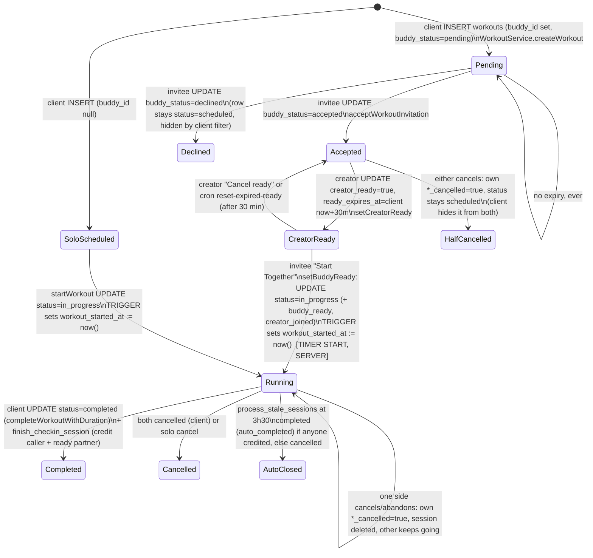

# H0 audit: workout invites, handshake, pushes

Audited 2026-10-08 on branch `feat/handshake-h0`. Everything was read only: live DB (`supabase db query --linked`, SELECT / `pg_get_functiondef` / catalogs only), deployed Edge Functions (the deployed `send-notification` v11 is byte-identical to the repo), and the Dart sources. Nothing was fixed. Findings are listed only.

## Summary (10 lines)

1. An invite is a row in `workouts` (`user_id` = inviter, `buddy_id` = invitee, `buddy_status` pending/accepted/declined). The `workout_invites` table and its two push triggers are legacy: nothing writes to it any more (0 pending rows, `WorkoutInviteService.sendInvite` has no caller).
2. As a result, **no push is sent today for invite received, accepted or declined**. `notification_log` has never logged a `workout_*invite*` type.
3. Every handshake step is a direct client `UPDATE` on `workouts`. The UPDATE policy lets either participant change **any column** (including `buddy_status`, `creator_ready`, `buddy_ready`, `user_id`, `buddy_id`). The only RPC is `finish_checkin_session`.
4. The start time is server-side already: `_clamp_client_workout_writes` sets `workout_started_at := now()` on the flip to `in_progress`. But the flip is triggered only by the **invitee** tapping "Start Together" after the **creator** has tapped "I'm Ready". The order is fixed, so it is not "either can tap first".
5. Timers read the server `workout_started_at`, then count with the device clock (`DateTime.now()` diff, then `+1` per tick). Clock skew shows on screen.
6. Missing: invite cap, invite expiry (stale pending rows from 2025 still exist), can't-make-it as distinct from decline, cancel-for-both before start, workout nudge, overlap warning, all handshake pushes.
7. Rule 1 crediting (start-day credit, 3h30 max, 3h40 reconcile grace, ready-and-not-cancelled partner credited) **exists** in `finish_checkin_session`, `process_stale_sessions` and `reconcile_stale_streaks`. A second, older credit path (`checkin_team_for_user`, uses "today", not start day) is still called from `SchedulePage._doCompleteWorkout`.
8. Confirmed: one check-in counts for every active team streak of the user that day (`_server_checkin` loops all of them).
9. Realtime: only `daily_team_checkins` is in the `supabase_realtime` publication. The Schedule page has no realtime and no polling at all; it only refreshes on pull-to-refresh or after its own actions.
10. Pushes: one Android channel, `notification` message (not data-only), no colour, tag or image, small icon is the full-colour launcher mipmap, tap does nothing, no cold-start tap handling. Avatars are emoji except the bear (code-drawn painter), so a large-icon avatar must be rendered in Dart.

---

## Part 1: today's flow, database

### 1.1 Tables

#### `workouts` (the invite and the session row)

| Column | Type / default | Role today |
|---|---|---|
| `id` | uuid | |
| `user_id` | uuid NN, FK user_profiles CASCADE | **creator / inviter** |
| `buddy_id` | uuid, FK user_profiles SET NULL | **invitee / participant** (null = solo) |
| `workout_type` | text NN | checked by `_enforce_workout_type_catalog` |
| `workout_date` | date NN | planned date (client local date) |
| `workout_time` | time NN (no tz) | planned time (client wall clock, **no timezone**) |
| `status` | text, default `scheduled`; CHECK scheduled/in_progress/completed/cancelled | session status |
| `buddy_status` | text, default `pending`; CHECK pending/accepted/declined | invite answer |
| `planned_duration_minutes` | int | goal |
| `actual_duration_minutes` | int | clamped by trigger, ≥15 when completed |
| `workout_started_at` | timestamptz | **timer start, set server-side by trigger** |
| `workout_completed_at` | timestamptz | clamped to `now()` |
| `started_by_user_id` | uuid FK auth.users | who flipped to in_progress |
| `creator_joined`, `creator_joined_at`, `creator_popup_shown` | bool / tstz / bool | legacy "buddy started, creator joins within planned/4" window |
| `creator_ready` | bool false | "I'm Ready" (creator only) |
| `buddy_ready` | bool false | set when invitee taps Start Together |
| `ready_expires_at` | timestamptz | client sets now+30 min; cron resets |
| `creator_cancelled`, `buddy_cancelled` | bool false | per-person cancel / leave |
| `cancel_requested_by`, `cancel_requested_at` | uuid / tstz | **unused by Dart** (index exists) |
| `buddy_completed_at` | tstz | buddy finished |
| `overtime_nag_count` (int NN 0), `last_overtime_nag_at` | | overtime cron state |
| `auto_completed` (bool NN), `auto_completed_notice_seen_at` | | server-only (guard trigger) |
| `notes`, `created_at`, `updated_at` | | |

Constraints: PK, FK above, `workouts_status_check`, `workouts_buddy_status_check`. **No** constraint on planned time, invite count, expiry or overlap.
Indexes: `idx_workouts_user_date (user_id, workout_date)`, `idx_workouts_buddy_date (buddy_id, workout_date)`, `idx_workouts_in_progress_buddy (buddy_id, status) WHERE in_progress`, `idx_workouts_started_by`, `idx_workouts_cancel_request`.

RLS (all roles `{public}`):

| Policy | Cmd | Rule |
|---|---|---|
| Users can view their workouts | SELECT | `uid = user_id OR uid = buddy_id` |
| Users can create workouts | INSERT | check `uid = user_id` |
| Users can update own or buddy workouts | UPDATE | `uid = user_id OR uid = buddy_id`, **no WITH CHECK** |
| Users can update their workouts | UPDATE | `uid = user_id` (redundant) |
| Users can delete their workouts | DELETE | `uid = user_id` |

Grants: `authenticated` has INSERT/UPDATE on **every column**; `anon` has SELECT (RLS returns nothing for anon).

Triggers on `workouts`:

| Trigger | Fn | Def/Inv | search_path | What it does |
|---|---|---|---|---|
| `clamp_client_workout_writes` BEFORE INS/UPD | `_clamp_client_workout_writes` | INVOKER | public | client INSERT must be `scheduled`, start nulled; on UPDATE to `in_progress` **sets `workout_started_at := now()`**, otherwise start immutable; completed only from in_progress; caps duration at server elapsed +1 and 210 |
| `enforce_workout_completion_duration` BEFORE INS/UPD OF status, actual_duration | `_enforce_workout_completion_duration` | INVOKER | public | completed needs duration ≥15 |
| `enforce_workout_daily_cap` BEFORE INS/UPD | `_enforce_workout_daily_cap` | **DEFINER** | public | max 4 completed per user-local day |
| `enforce_workout_type_catalog` | `_enforce_workout_type_catalog` | INVOKER | public | type must be in catalog |
| `guard_client_auto_complete_flags` | `_guard_client_auto_complete_flags` | INVOKER | public | client can't set `auto_completed`; notice-seen one-way |
| `trigger_cleanup_workout_sessions` AFTER UPD | `cleanup_workout_sessions` | INVOKER | **none** | in_progress → completed/cancelled deletes all `active_checkin_sessions` for the workout |

No notification trigger exists on `workouts`.

#### `active_checkin_sessions` (one running timer per user)

Columns: `id`, `user_id` (NN, **UNIQUE**), `started_at` (NN, default now), `workout_id` (FK workouts CASCADE), `linked_workout_id` (FK workouts CASCADE, legacy), `workout_type`, `workout_emoji`, `planned_duration`, `goal_notified_at`, `reminder_notified_at`, `created_at`.
RLS: own rows only for SELECT/INSERT/UPDATE/DELETE (`uid = user_id`). Grants: authenticated full DML.
Trigger `pin_client_session_start` (`_pin_client_session_start`, INVOKER, public): `workout_id` must be a workout you're in (`workout_not_yours`); `started_at` is kept only if equal to that workout's `workout_started_at`, otherwise forced to server `now()` (INSERT) or the old value (UPDATE).

#### `workout_invites` (legacy, dead)

Columns: `id`, `sender_id`, `recipient_id`, `scheduled_for` tstz, `message`, `status` (CHECK pending/accepted/declined), `created_at`, `updated_at`. 22 rows (14 accepted, 8 declined, 0 pending).
RLS: SELECT/UPDATE sender or recipient (UPDATE has a WITH CHECK, but either side can set any status), INSERT sender, DELETE sender. Grants: authenticated full DML, anon SELECT.
Triggers: `on_workout_invite` → `notify_workout_invite`, `on_workout_invite_response` → `notify_workout_invite_response`.
Dart: `WorkoutInviteService` (`getPendingInvites`, `acceptInvite`, `declineInvite`) is still mounted via `WorkoutInvitesCardRedesigned` on the Schedule page. `sendInvite` has no caller. `SchedulePage._debugCheckInvites` selects the whole table on every open.

#### Credit / log tables

| Table | Key columns | Constraints / RLS |
|---|---|---|
| `daily_team_checkins` | `team_streak_id`, `user_id`, `check_in_date` (default CURRENT_DATE), `check_in_time` | UNIQUE (team_streak_id, user_id, check_in_date), and a duplicate unique index. INSERT own row for own team; SELECT own, teammates, accepted friends. Triggers: `pin_client_checkin_date` (client date := user-local today), `on_buddy_checkin` (push), `on_checkin_fulfil_invite_reward`. In `supabase_realtime` publication. |
| `workout_logs` | `user_id`, `workout_date`, `workout_time`, `workout_name`, `workout_category`, `workout_emoji` default `'💪'`, planned/actual duration, `buddy_id`, `team_id`, `auto_completed`, `auto_completed_notice_seen_at` | own rows SELECT/INSERT/UPDATE. Triggers: `enforce_workout_log_duration`, `guard_client_auto_complete_flags`. |
| `buddy_nudges` | `sender_id`, `receiver_id`, `nudge_date` (default CURRENT_DATE) | UNIQUE (sender, receiver, nudge_date). INSERT/SELECT as sender. No workout link. |
| `notification_log` | `user_id`, `notification_type`, `reference_id`, `sent_at`, `batch_key` | index (user_id, type, sent_at). Service role ALL; user SELECT own. 251 rows: buddy_checked_in 94, coach_max_motivational 76, friend_request 35, streak_broken 18, streak_danger 18, workout_overtime 10. |
| `notification_settings` | `notif_social`, `notif_workouts`, `notif_streaks`, `notif_coach_max`, `quiet_hours_enabled` (true), `quiet_hours_start` 23, `quiet_hours_end` 7, `live_checkin_banner` | own row ALL |
| `device_tokens` | `user_id`, `token` UNIQUE, `platform` default android | own rows ALL; claimed via `register_device_token` RPC. 1 token live. |

No `dashboard_checkins` table exists. That name is the private Realtime channel topic (04b).

### 1.2 Functions on the flow (live definitions)

Grants column: `PUBLIC` means `=X` (PUBLIC, anon, authenticated all may execute). "svc" means postgres and service_role only.

| Function | Def/Inv | search_path | Execute | Validates | Writes |
|---|---|---|---|---|---|
| `finish_checkin_session(p_workout_id uuid default null)` | DEFINER | public | authenticated, svc | caller auth'd; start = `workouts.workout_started_at` (when caller is participant) else `session.started_at`; credit day = start's local day if start ≤210 min ago, else today; repeat call reuses the last ≤210-min check-in day | `_server_checkin(caller, day)` (all teams), deletes caller's session; **M6a**: partner credited on *their* start-local day if `partner_ready AND NOT partner_cancelled` and start ≤210 min ago; deletes partner's session. **Does not touch `workouts.status`** (client does that). |
| `process_stale_sessions(p_now default now())` | DEFINER | public | svc (pg_cron `*/5`) | sessions whose goal passed (goal clamped 15..210, default 30) | before 3h30: push "Workout complete" at goal, "Workout waiting" +1h (session owner only); >24h: delete silently; at 3h30: `_auto_credit` every non-cancelled session holder, then ready-not-cancelled participants without session (**M6b**), closes the row `completed` (goal duration) or `cancelled`, `auto_completed = true`; second loop closes in-progress rows nobody holds a session for |
| `_auto_credit(user, start, goal, type, emoji)` | INVOKER | public | svc | one auto log per user per start-local day | `_server_checkin` + `workout_logs` row (`auto_completed`) |
| `_server_checkin(user, day)` | INVOKER | public | svc | | cancels today's break; **inserts `daily_team_checkins` for every active team streak of the user**, recompute + rewards per team, Coach Max mirror |
| `checkin_team_for_user(p_target_user_id, p_workout_id)` | DEFINER | public | authenticated, svc | caller and target are the workout's creator/buddy | inserts check-ins for all target's teams **on target's today** (not start day), rewards. No ready/cancel/age check. Called by `SchedulePage._doCompleteWorkout` |
| `get_workouts_awaiting_creator_join(creator_id)` | INVOKER | public | authenticated, svc | **no caller check** (RLS limits rows) | read only: buddy-started, creator-not-joined, join window = planned/4 |
| `is_user_in_active_workout(check_user_id)` | DEFINER | **none** | svc only | | read only (Dart re-implements it client-side) |
| `create_buddy_workout_sessions(...)` | DEFINER | public | svc only | none | upserts two sessions (unused by Dart) |
| `get_team_checkin_order(p_team_streak_id, p_check_date)` | INVOKER | **none** | **PUBLIC incl. anon** | none (RLS) | read only (unused by Dart) |
| `cleanup_workout_sessions()` trigger | INVOKER | **none** | PUBLIC | | see triggers |
| `notify_workout_invite()` / `notify_workout_invite_response()` | DEFINER | **none** | PUBLIC | | `net.http_post` to send-notification (legacy table only) |
| `notify_buddy_checkin`, `notify_friend_request`, `notify_friend_accepted`, `notify_streak_update` | DEFINER | **none** | PUBLIC | | pushes (Part 3) |
| `reconcile_stale_streaks()` | DEFINER | public | svc (cron `5 * * * *`) | Rule 1 grace: a session or workout started ≤ **220 min** ago on the member's day still protects the streak | streak loss events |
| `_recompute_team_streak` / `recompute_team_streak` | DEFINER | public | svc / authenticated | membership | streak rows |

There are no `invite_workout`, `respond_invite`, `set_ready`, `start_workout` or `cancel_workout` RPCs. All of those are client UPDATEs (Part 2).

pg_cron jobs touching the flow:

| Job | Schedule | Command |
|---|---|---|
| `reset-expired-ready` | `*/5` | `UPDATE workouts SET creator_ready=false, buddy_ready=false, ready_expires_at=NULL WHERE creator_ready AND ready_expires_at < now() AND status='scheduled'` |
| `process-stale-sessions` | `*/5` | `process_stale_sessions()` |
| `workout-overtime-every-5min` | `*/5` | POST `workout-overtime-cron` |
| `reconcile-stale-streaks-hourly` | `5 * * * *` | `reconcile_stale_streaks()` |
| `coach-max-hourly` | `0 * * * *` | POST `coach-max-cron` |

### 1.3 Current lifecycle (state machine)



Where the timer start comes from: `workouts.workout_started_at`, always written by `_clamp_client_workout_writes` with server `now()` on the transition into `in_progress`. The client also sends its own `now` in the same UPDATE, but the trigger overrides it. The session's `started_at` is pinned to that value by `_pin_client_session_start`.

Legacy branch, still live: if the **invitee** starts first via `startWorkout`, the creator gets `JoinWorkoutPopup` / "Join Workout" (window = planned/4) through `creatorJoinWorkout`. The creator's session then starts at the server join time and gets a reduced `planned_duration` (remaining minutes).

### 1.4 Gap list against the approved rules

| Rule | Status | Why |
|---|---|---|
| One card, one action per state | partly | `WorkoutCard` exists, but up to three sections stack and several buttons are shown per state |
| Tap, not hold | exists | all taps |
| Either person can tap first | **missing** | only creator has "I'm Ready"; invitee only sees "Waiting for X to get ready" until then |
| Timer starts server-side on second tap | partly | start is server `now()` via trigger, but "second tap" = invitee's Start Together only; no server function owns the transition |
| Both clients draw from server start | partly | both read `workout_started_at`, but elapsed uses device clock; `WorkoutCard` increments locally |
| States: invited/waiting with "Starts in…" | missing | no countdown; planned time is `date` + naive `time` with no timezone |
| States: time to start / I tapped / buddy tapped first | partly | only creator-ready → buddy-start exists |
| Goal reached → Finish unlocks | exists | "Complete Goal First" lock in `WorkoutCard`, sheet timer |
| Buddy can't make it (inviter: Go solo / Cancel) | **missing** | invitee only has Decline before accepting; after accepting, cancel sets `buddy_cancelled` and the row vanishes for **both** (client filter) |
| Inviter Change time | missing | no edit path |
| Inviter Cancel workout cancels for both + notifies | partly | client filter hides it for both, but `status` stays `scheduled`, `creator_cancelled=true` only; no push |
| Invitee Can't make it (no penalty) | missing | there is no penalty concept today either |
| Leave workout while running (your timer stops, no credit, other continues) | exists (logic) / partly | `cancelWorkout` sets own flag, deletes own session; M6a/M6b skip cancelled; labelled "Abandon Workout"; no push to the other |
| Solo says Abandon | exists | |
| "Are you sure?" | partly | cancel has one; ready/leave flows differ |
| Nudge: one push to non-tapper, max 1 / 10 min / workout | **missing** | only the streak nudge (`buddy_nudges`, 1 per sender→receiver per **day**, client-side 10:00 gate, client sends the push) |
| Max 5 open invites; 6th told, receiver not notified | **missing** | no limit of any kind |
| Expire 15 min after planned time | **missing** | no expiry; 1 pending invite from 2025-10-15 still open |
| Overlap warning on accept; one workout at a time | partly | `createWorkout` refuses only if someone is *running* now (client check); `active_checkin_sessions.user_id` UNIQUE gives one session at a time; no scheduled-overlap check, no accept check |
| One check-in counts for all team streaks | exists | `_server_checkin` loops all active streaks (see 1.5) |
| Realtime via private channel only | partly | only `dashboard_checkins` exists and is private; `workouts` not published |
| Rule 1: credit local day it started | exists | `finish_checkin_session`, `_auto_credit` use start-local day |
| Rule 1: max session age 3h30 | exists | `210 minutes` everywhere |
| Rule 1: reconcile grace 3h40 | exists | `reconcile_stale_streaks` `220 minutes` |
| Rule 1: ready, not cancelled buddy credited | exists | M6a in finish, M6b in auto-complete. Note: `buddy_ready` is only ever set by Start Together, so a creator who started solo-style isn't "ready" |

### 1.4b Other things found (listed, not fixed)

* **Handshake forgery (security):** UPDATE RLS has no column limits and no WITH CHECK. A creator can set `buddy_status='accepted'` and `buddy_ready=true` for the invitee, and an invitee can set `creator_ready=true`. Via M6a/M6b this credits the other person's streak without them doing anything. Either side can also rewrite `user_id`/`buddy_id`.
* `SchedulePage._doCompleteWorkout` still calls `checkin_team_for_user` for the partner. That path credits on the partner's *today*, requires `buddy_completed_at` client-side, and ignores ready flags. This contradicts Rule 1 (fallback path only).
* `ready_expires_at` is client-computed.
* `getUpcomingWorkouts` uses the device's local date string for `.gte('workout_date', today)`.
* `cancel_requested_by/_at` are dead columns. `create_buddy_workout_sessions`, `get_team_checkin_order` and `is_user_in_active_workout` are unused by Dart.
* `notify_*` trigger functions and `is_user_in_active_workout` are SECURITY DEFINER with no `search_path`. They are trigger/service-only, but still PUBLIC-executable where `=X`.
* `get_team_checkin_order` is executable by anon.
* `daily_team_checkins` has two identical unique indexes.

### 1.5 Open invites right now

Pending invite = `workouts` row with `status='scheduled' AND buddy_status='pending' AND buddy_id IS NOT NULL` (`workout_invites` has 0 pending).

| Sender (account id) | Open invites |
|---|---|
| `380d0d9b-7c26-43b4-8057-bf018fb5bf59` | 1 (planned 2025-10-15 19:50, never expired) |

Top receiver: `3c7f73a4-ffb1-4fca-ad87-05cfe35cc878` with 1.

| Open invites sent | Users (of 39) |
|---|---|
| 0 | 38 |
| 1–2 | 1 |
| 3–4 | 0 |
| 5+ | 0 |

Also found: 2 `scheduled/accepted` rows from 2025-12-02 and 2026-07-03, and 1 solo `scheduled` row from 2026-06-10, all stale. A cap of 5 hurts nobody today. The expiry job will need a one-off sweep for these.

### 1.6 Streak check: one check-in, all teams

Confirmed from the function bodies. `public._server_checkin(p_user_id, p_day)` runs:

```sql
FOR t IN SELECT ts.id, bt.is_coach_max_team FROM team_streaks ts
  JOIN team_members tm ON tm.team_id = ts.team_id JOIN buddy_teams bt ON bt.id = ts.team_id
  WHERE tm.user_id = p_user_id AND ts.is_active = true
LOOP INSERT INTO daily_team_checkins ... ON CONFLICT DO NOTHING; recompute; rewards; Coach Max mirror
```

Every credit path routes through it: `finish_checkin_session` (caller and M6a partner) and `_auto_credit` (M6b). The legacy `checkin_team_for_user` loops the same way. UNIQUE (team_streak_id, user_id, check_in_date) keeps it idempotent.

---

## Part 2: today's flow, Dart

| File : lines | Class / method | What it does | DB access | Live updates |
|---|---|---|---|---|
| `lib/home_screen.dart:5125-5821` | `SchedulePage` / `_SchedulePageState` | the "Workout Schedule" tab: list of `WorkoutCard`s, `WorkoutInvitesCardRedesigned`, `CompletedWorkoutsSection` | direct (`workouts`, `active_checkin_sessions`, `workout_invites`) | **none**: `loadData()` on init, pull-to-refresh, after own actions |
| `home_screen.dart:5148-5163` | `_debugCheckInvites` | selects all `workout_invites` on every open | direct | |
| `home_screen.dart:5192-5363` | `_startWorkout` | `startWorkout`, links session to workout, opens `WorkoutCheckInSheet`; finish → `completeWorkoutWithDuration` + `checkInAllTeams` (→ `finish_checkin_session`) | direct + RPC | |
| `home_screen.dart:5365-5554` | `_completeWorkout` / `_doCompleteWorkout` | fallback complete + legacy partner credit via `checkin_team_for_user` | direct + RPC | |
| `home_screen.dart:5556-5607` | `_cancelWorkout` | confirm dialog → `cancelWorkout`, solo forced `cancelled` | direct | |
| `home_screen.dart:5609-5648` | `_setReady`, `_startTogether` | ready-check handlers | direct (via service) | |
| `home_screen.dart:5650-5704` | `_joinWorkout`, `_acceptInvitation`, `_declineInvitation` | legacy join window, invite answer | direct | |
| `home_screen.dart:3465-3636` | `_checkIn`, `_adoptLiveBuddyWorkoutSession`, `_checkForActiveWorkout` | dashboard check-in adopts a running buddy workout's session | direct | |
| `home_screen.dart:3872-3915` | `_acceptWorkoutInviteDash` / `_declineWorkoutInviteDash` | invite answer from Dashboard tray | direct | |
| `home_screen.dart:683` | `WorkoutJoinChecker.checkForPendingJoins` | on dashboard init | RPC `get_workouts_awaiting_creator_join` | once per app open |
| `home_screen.dart:756-775` | `_subscribeToCheckIns` | private channel `dashboard_checkins`, postgres_changes INSERT on `daily_team_checkins` | Realtime | live |
| `lib/widgets/workout_card.dart:8-1053` | `WorkoutCard` | one workout card: states `scheduled / waiting_to_join / window_expired / in_progress / buddy_completed`, ready sections, invite actions, Complete (locked until goal), Abandon | none (callbacks) | `Timer.periodic(1s)` at `:85` |
| `workout_card.dart:71-95` | `_initTimers` | elapsed = `DateTime.now() - workout_started_at`, then `++` each tick | | local clock |
| `workout_card.dart:124-151` | `_readyActive`, `_creatorWaitingReady`, `_buddyCanStartTogether` | ready check, honours `ready_expires_at` vs device UTC | | |
| `workout_card.dart:763-1000` | `_buildWorkoutActions` | per-state buttons ("I'm Ready", "Cancel ready", "Start Together", "Join Workout", "Not joining", "Complete Goal First", "Abandon Workout", "Start Workout") | | |
| `lib/widgets/workout_checkin_sheet.dart:13-676` | `WorkoutCheckInSheet` | full timer sheet; reads `active_checkin_sessions.started_at` (pinned to server start), else inserts with local now (server re-pins) | direct (`active_checkin_sessions`, `workouts`) | `Timer.periodic(1s)` at `:207`, recomputes `DateTime.now() - start` each tick (no drift, but device-clock skew) |
| `lib/widgets/join_workout_popup.dart:11-475` | `JoinWorkoutPopup` | legacy creator join-window popup (countdown) | via service | `Timer.periodic(1s)` at `:81` |
| `join_workout_popup.dart:477-881` | `BuddyInWorkoutPopup`, `MissedWorkoutPopup`, `BuddyCompletedWorkoutPopup` | info popups | | |
| `lib/widgets/workout_join_checker.dart:10-160` | `WorkoutJoinChecker` | shows join popup once per app open; honours `user_profiles.workout_join_popups_enabled` | RPC + direct | |
| `lib/widgets/workout_invites_card.dart:7-482` | `WorkoutInvitesCardRedesigned` | **legacy** `workout_invites` card (always empty now) | via `WorkoutInviteService` (direct) | none |
| `lib/services/workout_invite_service.dart:5-221` | `WorkoutInviteService` | legacy invite table; `acceptInvite` inserts a `workouts` row with roles swapped | direct | |
| `lib/services/workout_service.dart:5-757` | `WorkoutService` | all workout writes. Every method below is a direct `.from('workouts').update/insert` | direct; RPC only `get_workouts_awaiting_creator_join` | |
| `workout_service.dart:93-109` | `acceptWorkoutInvitation` | `buddy_status=accepted` | direct | |
| `workout_service.dart:111-159` | `creatorJoinWorkout` | legacy join window | direct | |
| `workout_service.dart:222-250` | `setCreatorReady` | `creator_ready`, `ready_expires_at = local now+30m` | direct | |
| `workout_service.dart:252-310` | `setBuddyReady` | `status=in_progress` (guarded `.neq`), `buddy_ready`, `creator_joined`, upsert session | direct | |
| `workout_service.dart:314-352` | `createWorkout` | INSERT; refuses if either is in a running workout | direct | |
| `workout_service.dart:354-375` | `startWorkout` | solo / buddy-first start | direct | |
| `workout_service.dart:377-420` | `completeWorkoutWithDuration` | client-computed duration (server clamps), `buddy_completed_at`, delete session | direct | |
| `workout_service.dart:422-482` | `declineWorkoutInvitation`, `cancelWorkout` | decline; per-person cancel / both-cancelled → `cancelled` | direct | |
| `workout_service.dart:531-590` | `getUpcomingWorkouts` | scheduled (local date ≥ today) + in_progress, embeds `avatar_id`; hides scheduled rows if either cancelled or declined | direct | |
| `lib/services/team_streak_service.dart:260-360`, `:633` | `checkInAllTeams`, `checkInAllTeamsForUser` | RPC `finish_checkin_session`, RPC `checkin_team_for_user` | RPC | |
| `lib/services/nudge_service.dart:6-128` | `NudgeService` | streak nudge: `buddy_nudges` insert + client calls `send-notification` | direct + Edge Fn | |
| `lib/widgets/schedule_workout_sheet.dart:10-1027`, `quick_schedule_sheet.dart:8-642` | `ScheduleWorkoutSheet`, `QuickScheduleSheet` | create workout / invite (buddy picker from `FriendService.getFriends`) | via `createWorkout` | |

**There is no separate "handshake page".** The handshake being replaced is spread across the ready sections of `WorkoutCard`, the `JoinWorkoutPopup` / `WorkoutJoinChecker` join window, `WorkoutCheckInSheet`, and the Schedule page handlers above.

**Timer:** anchored to the server timestamp (`workouts.workout_started_at`, and the session `started_at` pinned to it), but elapsed is computed against the device clock.

### `avatar_id`, `avatar_border`, `ring_color` call sites

Reads `avatar_id`: `workout_service.dart:540,541,552,553,623,624,664,665,686,687` (embeds), `workout_invite_service.dart:56,81,206,207`, `friend_service.dart:36,340,391`, `team_streak_service.dart:151`, `home_screen.dart:711,723,5888,5974`, `wardrobe_selection_state.dart:30,57`, `friends_page_modern.dart:965,1181,1733,1807`, `profile_view_dialog.dart:250`, `schedule_workout_sheet.dart:938,944`, `completed_workouts_section.dart:198`, `onboarding_value_props.dart:653`.
Writes `avatar_id`: `avatar_picker_screen.dart:203,656`, `wardrobe_selection_state.dart:112`, `onboarding_basic_info_new.dart:492,873`.
Reads `avatar_border`: `wardrobe_selection_state.dart:30,59`, `friend_service.dart:391`, `friends_page_modern.dart:404,808,1326`, `profile_view_dialog.dart:199`.
Writes `avatar_border`: `avatar_picker_screen.dart:204`, `wardrobe_selection_state.dart:113`, `onboarding_basic_info_new.dart:493,874`.
`ring_color`: `coin_service.dart:105-130` (`getEquippedColorHexForUsers`, read), `home_screen.dart:589` (`_memberRingColors`), `wardrobe_selection_state.dart:35,124` (equip = write via `CoinService.equipItem`), `shop_page.dart:32,74,107`.

---

## Part 3: pushes

### 3.1 Every push today

All go through `send-notification`. Emoji code points: 💪 U+1F4AA, 🎉 U+1F389, 👋 U+1F44B, 💔 U+1F494, 🏋️ U+1F3CB U+FE0F, ✅ U+2705, ❌ U+274C, ⏱️ U+23F1 U+FE0F, 🤖 U+1F916, 🔥 U+1F525, 🚀 U+1F680, 🏆 U+1F3C6, 👑 U+1F451, em dash — U+2014. Channel is always `gym_buddy_high_importance`.

| # | Source | Trigger event | Recipient | Title | Body | `type` / gate (`notification_settings`) | batch_key (1 h dedupe) |
|---|---|---|---|---|---|---|---|
| 1 | `notify_friend_request` (trigger `on_friend_request`, AFTER INSERT friendships WHEN pending) | friend request | `friend_id` | `👋 New Friend Request!` | `{name} wants to be your gym buddy!` | `friend_request` / notif_social | none |
| 2 | `notify_friend_accepted` (`on_friend_accepted`, AFTER UPDATE friendships) | pending→accepted | requester `user_id` | `🎉 Friend Request Accepted!` | `{name} is now your gym buddy!` | `friend_accepted` / notif_social | none |
| 3 | `notify_workout_invite` (`on_workout_invite`, `workout_invites` INSERT) | **dead** (table unused) | recipient | `🏋️ Workout Invite!` | `{name} invited you to a workout!` | `workout_invite` / notif_workouts | none |
| 4 | `notify_workout_invite_response` (`on_workout_invite_response`) | **dead** | sender | `✅ Workout Accepted!` / `❌ Workout Declined` | `{name} is joining your workout!` / `{name} can't make the workout.` | `workout_accepted` / `workout_declined`, notif_workouts | none |
| 5 | `notify_buddy_checkin` (`on_buddy_checkin`, AFTER INSERT daily_team_checkins) | any check-in incl. Coach Max mirror and auto-credit | **one** other team member (`LIMIT 1`) | `💪 Buddy Checked In!` | `{name} just checked in — your turn!` | `buddy_checked_in` / notif_streaks | `checkin_{team}_{UTC CURRENT_DATE}` |
| 6 | `notify_streak_update` (`on_streak_update`, AFTER UPDATE team_streaks) | streak → 0 | all members (incl. Coach Max id) | `💔 Streak Broken!` | `Your {team_name} streak was reset. Start fresh today!` | `streak_broken` / notif_streaks | none |
| 7 | same | streak hits 7/14/30/50/100 | all members | `🎉 {n} Day Milestone!` | `You and {team_name} hit a {n} day streak!` | `streak_milestone` / notif_streaks | none |
| 8 | `process_stale_sessions` (cron */5) | session reached goal | session owner, only if a token exists | `Workout complete` | `Workout complete. Log back into the app to confirm.` | `workout_overtime` / notif_workouts | `session_goal_{session}` |
| 9 | same | goal + 1 h | session owner | `Workout waiting` | `Your workout is still waiting. Open the app to confirm it.` | `workout_overtime` | `session_reminder_{session}` |
| 10 | `workout-overtime-cron` (cron */5) | in_progress, planned + 15 min, then every 30 min, max 3 | **creator only** (`w.user_id`) | `⏱️ Still working out?` | `Your workout has run well past its planned time — tap to end it if you're done.` | `workout_overtime` (quiet hours pre-checked in the fn) | `workout_overtime_{id}_{n}` |
| 11 | `coach-max-cron` PART 2 (hourly) | Coach Max scheduled check-in done | user | `🤖 Coach Max` | random: streak 0 → `Day 1 starts now! Let's build something great! 💪` / `Every champion started somewhere. Today is your day!` / `Ready to begin? Let's go! 🚀`; ≥30 → `{n} DAYS! You're a legend! 🏆` / `This {n}-day streak is INSANE! Keep it alive! 🔥` / `Champion mentality! {n} days strong! 👑`; ≥7 → `{n} days strong! You're building something special! 🔥` / `Look at that {n}-day streak! Consistency is key! 💪` / `{n} consecutive days! You're on fire! 🔥`; else `Ready to work? Let's do this! 💪` / `Another day, another opportunity! Let's go!` / `Day {n+1} awaits! Let's make it count! 🔥` / `Keep the momentum going! 🚀` | `coach_max_motivational` / notif_coach_max | `coach_max_daily_{localDate}_{user}` |
| 12 | `coach-max-cron` PART 3 | 18:00 member-local, not checked in, not on break | member | `🔥 Streak in Danger!` | n=1: `Don't lose your first streak day! Check in before midnight!`; else `Your {n}-day streak ends at midnight — check in now!` | `streak_danger` / notif_streaks | `streak_danger_{user}_{localDate}` |
| 13 | Dart `NudgeService.sendNudge` (client → Edge Fn) | user taps nudge on dashboard | buddy | `🔥 Don't break the streak!` | `{sender} is waiting on your check-in — keep it going!` | `buddy_nudge` / notif_streaks | `nudge_{sender}_{target}_{localDate}` |

The Coach Max mirror check-in (service role insert) also fires #5 to the user ("{Coach Max} just checked in — your turn!"). Pushes #8/#9 and #10 can both fire for the same workout.

Category map entries with no sender anywhere: `workout_starting_soon`, `buddy_started_workout`, `join_window_expiring`, `streak_complete`, `break_day_taken`, `coach_max_checked_in`.

### 3.2 `send-notification` (deployed v11 = repo)

* **Auth:** service-role bearer may notify anyone. Any user JWT may notify itself or any accepted friend or teammate, **with free title/body** (sanitised, ≤100/≤300 code points). There is no rate limit, so the client nudge works only by convention.
* **Gates:** recipient's `notification_settings`. Quiet hours use the recipient's `user_profiles.timezone` (fallback Europe/Dublin), then the category map. No settings row means everything is allowed.
* **Dedupe:** only when `batch_key` is given. Skipped if a `notification_log` row with the same user+batch_key exists in the **last 1 hour** (not 5 minutes). It uses `.maybeSingle()`, so ≥2 matching rows makes the lookup error and the dedupe silently passes.
* **FCM v1 message:**
  ```json
  { "token": "…", "notification": { "title": "…", "body": "…" },
    "data": { "type": "…", "reference_id": "…" },
    "android": { "priority": "high", "notification": { "channel_id": "gym_buddy_high_importance" } } }
  ```
  No `color`, `tag`, `image`, `icon`, `collapse_key`, `notification_count`, `apns` or `click_action`. Because it is a `notification` message, Android renders it from the system tray when the app is backgrounded or killed. Dart code doesn't run there.
* **Log:** after the send loop, one row per call (`user_id`, `notification_type`, `reference_id`, `batch_key`), even when every token failed.
* **Tokens:** `device_tokens`, claimed through `register_device_token` (UNIQUE token, moves between accounts). Deleted on FCM `UNREGISTERED`, and on sign-out by `NotificationService.removeToken`.

### 3.3 NAG-1 ("Still working out?")

Today it goes to the **creator only**. The select is `id, user_id, …` and the send uses `user_id: w.user_id`. Quiet hours are also read for `user_id` only. It ignores `creator_cancelled`/`buddy_cancelled`, so a creator who left still gets nagged and the buddy who's still in never does. Solo workouts are fine.

Minimal change (in `workout-overtime-cron/index.ts` only):
1. Add `buddy_id, creator_cancelled, buddy_cancelled` to the select.
2. Per workout, build recipients `[user_id if !creator_cancelled, buddy_id if buddy_id && !buddy_cancelled]`. Skip the workout if the list is empty.
3. Include `buddy_id`s in the tz/settings lookups. Do the quiet-hours check and the `fetch` per recipient, with `batch_key: workout_overtime_${w.id}_${uid}_${n}`.
4. Bump `overtime_nag_count` once per workout, as today.

(Also worth deciding: drop this cron for sessions that `process_stale_sessions` #8/#9 already cover, to avoid double nags.)

### 3.4 Client side

* **Channel** (`notification_service.dart:27-32`): id `gym_buddy_high_importance`, name `Gym Buddy Notifications`, `Importance.high`. Vibration and sound are the platform defaults; no custom sound and no vibration pattern. It is the only channel. Created in `_setupLocalNotifications`, which runs only when permission isn't denied.
* **Manifest:** `default_notification_icon = @mipmap/ic_launcher`. That is the **full-colour launcher icon, not a white silhouette**, so it renders as a grey/white blob in the status bar on Android 5+. No `res/drawable/ic_stat_*` exists. `default_notification_color = @color/notification_color` = `#FF6B35` (exists in `values/colors.xml`, orange). No `default_notification_channel_id` meta-data. `flutter_local_notifications` init also uses `@mipmap/ic_launcher`.
* **Handlers:** `_firebaseMessagingBackgroundHandler` is top-level, `@pragma('vm:entry-point')`, registered with `onBackgroundMessage` inside `initialize()` (not before `runApp`). It only logs. `onMessage` → `_handleForegroundMessage` shows an in-app `LiveEventToast` and **returns early when `message.notification == null`**, so **a data-only message is ignored in the foreground and nothing is shown in the background**. `onMessageOpenedApp` → `_handleNotificationTap` only logs. **`getInitialMessage()` is never called** (cold-start taps are lost), and the local-notification tap callback only logs.
* **Tap routing by `type`/`reference_id`:** none exists. `reference_id` is sent but never read on device.

### 3.5 Avatars as the large icon

* **Where they live:** there are no image assets. `lib/data/avatar_catalog.dart` lists **12** ids (`lion` (default), wolf, bear, eagle, shark, gorilla, tiger, buffalo, robot, flexed, weightlifter, runner), each with an **emoji**. Only `bear` has art: `lib/widgets/avatars/animated_bear.dart`, a `CustomPainter` (vector, code-drawn) via `avatarArt()`. Every other avatar renders as an emoji glyph, which conflicts with "no emojis anywhere" if the emoji is used as the large icon.
* **Option A, bundle drawables:** export each avatar to PNG (e.g. 192×192 xxxhdpi), add as `res/drawable-nodpi/avatar_<id>.png`, and pass `largeIcon: DrawableResourceAndroidBitmap('avatar_<id>')`. This costs a PNG per species. The ring colour can't be applied to a static drawable, so pre-rendering ×9 colours is not sensible.
* **Option B, draw in Dart:** `PictureRecorder` + `Canvas`, run the bear painter or draw the emoji with `TextPainter` (emoji then remain), add a `drawCircle` stroke in the ring colour, `toImage` → PNG bytes → `ByteArrayAndroidBitmap`. This works in the background isolate (dart:ui is available there).
* **What's needed for either:** pushes must become **data-only** (otherwise the tray draws them without our code). The background handler must call `flutter_local_notifications.show` itself, and the payload must carry `avatar_id`, `ring_hex` and the friend name.
* **What can break:** data-only messages to a **force-stopped** app are not delivered at all on Android. Under Doze, high-priority data messages are delivered, but FCM may deprioritise them if they don't result in a visible notification. Some OEM battery optimisers (Xiaomi, Huawei, Oppo, some Samsung modes) kill the background isolate. The handler gets roughly 20 s, so it needs a fallback that shows a plain notification if rendering fails. Cold start of the isolate adds 1–2 s latency. A safer hybrid: keep `notification` + `android.notification.image` for killed apps (image = a hosted PNG URL, no ring), and use the custom render only when data-only delivery succeeds.
* **Avatar on the LEFT:**
  * The standard templates put `largeIcon` on the right (Android 7+), and the left slot is reserved for the small icon / app icon.
  * Putting it on the left needs a custom `RemoteViews` layout (`setCustomContentView` + `DecoratedCustomViewStyle`). `flutter_local_notifications` 17 has **no custom-layout API**, so this means native Kotlin: a `FirebaseMessagingService` subclass or a method channel, plus XML layouts for collapsed/expanded.
  * Costs: native code to maintain; dark mode handled by hand (`values-night` colours, `TextAppearance.Compat.Notification*`); Android 12+ forces the decorated template and caps custom content height (~48 dp collapsed / 252 dp expanded); OEM skins vary; font scale and TalkBack need manual testing (custom views often clip at 1.3–2.0 scale); grouping, actions and the system "Messages"-style look are lost.
  * Fallback (recommended for H2): the standard `BigTextStyle` with the ring avatar as `largeIcon` on the right, the white-silhouette small icon on the left, tinted with the kind colour. Optionally `MessagingStyle` with a `Person` icon, which Android draws as a **left-side circular avatar** in conversation-style layout and needs no custom view. That is the closest native way to get the avatar on the left; worth a spike.

### 3.6 Buddy Ring Color

* **Client:** `CoinService.getEquippedColorHexForUsers(userIds)` (`coin_service.dart:105-130`) queries `user_inventory` joined to `shop_items!inner(color_hex)`, filtered `category='ring_color'` and `equipped=true`. `home_screen` fills `_memberRingColors` from it. Missing users fall back to `_memberColor` (hashed).
* **RLS** that allows it: `user_inventory` "Users can view partners' equipped items" (`equipped = true AND` caller and owner share a team with an **active** `team_streaks` row), plus "Users see all shop items" on `shop_items`.
* **Invited-but-not-accepted:** an invite only needs a friend (picker = `FriendService.getFriends`). Today 0 accepted friend pairs lack an active shared team, so it works in practice. But a pair without an active team streak (e.g. after a streak ends, or a future non-team invite) **cannot** read each other's ring colour. Not accepting an invite doesn't matter; team membership does.
* **Server side:** `shop_items.color_hex` exists (9 ring items, all with hex) and the service role bypasses RLS, so `send-notification` or the SQL sender can include `ring_hex` in the payload with one join.

### 3.7 Proposed inventory (wording is in owner's mockup board 13)

Kind colours: orange = your move, lavender = people, emerald = done, amber = running out of time, red = ended, grey = info.

| Push | Kind colour | Channel | Tag (replaces previous) | Exists today |
|---|---|---|---|---|
| Invite received | orange | Invites | `invite_{workout_id}` (+ group `invites`) | no (dead trigger on legacy table) |
| Invite accepted | lavender | Invites | `invite_{workout_id}` | no (dead) |
| Invite declined | grey | Invites | `invite_{workout_id}` | no (dead) |
| Invite expired unanswered | grey | Invites | `invite_{workout_id}` | no |
| Cancelled by inviter | red | Handshake | `hs_{workout_id}` | no |
| Time to start | orange | Handshake | `hs_{workout_id}` | no (`workout_starting_soon` in map only) |
| Buddy tapped first | orange | Handshake | `hs_{workout_id}` | no |
| Second person tapped (started) | emerald | Handshake | `hs_{workout_id}` | no |
| Nudge | orange | Handshake | `nudge_{workout_id}` | no (streak nudge only, #13) |
| Can't make it | grey | Handshake | `hs_{workout_id}` | no |
| Buddy left while running | grey | Handshake | `run_{workout_id}` | no |
| Buddy finished | emerald | Handshake | `run_{workout_id}` | no |
| Still working out | amber | Handshake | `run_{workout_id}` | yes (#10 creator only; #8/#9 overlap) |
| Before auto check-in at 3h30 | amber | Handshake | `run_{workout_id}` | partly (#9 "Workout waiting" at goal+1h, not timed to 3h30) |
| Friend request | lavender | Friends | `friend_{friendship_id}` | yes (#1) |
| Friend accepted | lavender | Friends | `friend_{friendship_id}` | yes (#2) |
| Streak grows | emerald | Streaks | `streak_{team_id}` | partly (#7 milestones only; #5 buddy check-in) |
| Streak ended | red | Streaks | `streak_{team_id}` | yes (#6) |

Coach Max (#11) and streak danger (#12) stay on a Coach Max / Streaks channel; they are not in this list.

---

## Part 4: realtime and RLS

* **Today the Schedule page listens to nothing.** No Realtime, no polling. `WorkoutCard` ticks only its own local timer. The only Realtime subscription in the app is the Dashboard's private channel `dashboard_checkins` (postgres_changes INSERT on `daily_team_checkins`).
* **Publication:** `supabase_realtime` contains **only `public.daily_team_checkins`**. `workouts` and `active_checkin_sessions` are not published, so postgres_changes on them would never fire today.
* **Channel policy:** `realtime.messages` SELECT "authenticated can join dashboard_checkins": `realtime.topic() = 'dashboard_checkins' AND topic = 'dashboard_checkins' AND extension IN ('broadcast','presence')`, `TO authenticated`. Which rows a subscriber receives is decided by the table's own RLS.

Row changes both phones need for the new card. All of them are UPDATEs on one `workouts` row, or the INSERT for a new invite:

| Event | Row change | Covered today? |
|---|---|---|
| Invite created | `workouts` INSERT (buddy_id = me) | no |
| Accepted / declined | `workouts` UPDATE `buddy_status` | no |
| I'm here (either) | `workouts` UPDATE ready flags (new columns or the existing two) | no |
| Started | `workouts` UPDATE `status`, `workout_started_at` | no |
| Cancelled / can't make it / left | `workouts` UPDATE `status` / `*_cancelled` | no |
| Finished | `workouts` UPDATE `status`, `buddy_completed_at` / `workout_completed_at` | no |

Needed extension (H1):
1. `ALTER PUBLICATION supabase_realtime ADD TABLE public.workouts;`. The existing `workouts` SELECT RLS (`uid IN (user_id, buddy_id)`) already limits delivery to the two participants.
2. Either subscribe the card on the existing `dashboard_checkins` topic (the policy allows it, but the name is misleading), or add a second `realtime.messages` SELECT policy with the same shape, topic = table name: `realtime.topic() = 'workouts' AND topic = 'workouts' AND extension IN ('broadcast','presence')`, `TO authenticated`, no INSERT policy.
3. Caveats: postgres_changes DELETE events are not RLS-filtered (only the PK is sent). Don't rely on DELETE, and keep soft states, which the flow already does. `REPLICA IDENTITY` default is enough (only new rows are needed). The card must still refetch on resume, because Realtime is not delivered while backgrounded.

---

## Questions that block H1 / H2

1. **Ready flags:** reuse `creator_ready`/`buddy_ready` (and drop `ready_expires_at` + the `reset-expired-ready` cron), or add `creator_here_at`/`buddy_here_at` timestamps? Does a tap "I'm here" ever expire before the planned time + 15 min?
2. **Planned time timezone:** `workout_date` + naive `workout_time`. "Starts in 2h 14m" and "expires 15 min after" need an absolute instant. Add `planned_at timestamptz` (computed in the inviter's tz) or interpret in the inviter's `user_profiles.timezone`?
3. **When may "I'm here" be tapped:** from the planned time only, or a window before it (e.g. −15 min)?
4. **Lock down `workouts` writes:** move every handshake transition into SECURITY DEFINER RPCs and revoke client UPDATE on handshake columns (needed to close the forgery hole). Agreed for H1?
5. **Legacy paths:** retire the join window (`creator_joined*`, `JoinWorkoutPopup`, `get_workouts_awaiting_creator_join`), the `workout_invites` table and card, and `checkin_team_for_user` partner credit in `_doCompleteWorkout`?
6. **Cap counting:** do the "5 open invites" count only *sent* pending invites, or also accepted-but-not-started ones?
7. **Pushes data-only?** Required for the avatar large icon, but loses delivery to force-stopped apps. Accept the hybrid (notification + `image` URL fallback)? If yes, where are avatar PNGs hosted (Storage bucket)? Bear is the only art; is an emoji large icon acceptable for the other 11 until art exists?
8. **NAG overlap:** keep both `process_stale_sessions` (#8/#9) and `workout-overtime-cron` (#10), or fold into one schedule matching "still working out" + "before auto check-in"?
